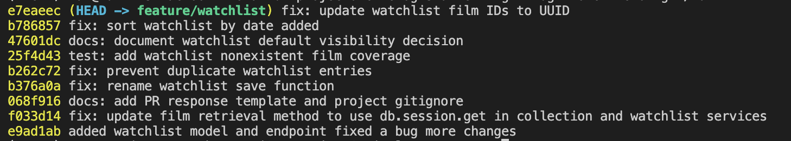

# PR Response Doc — CineLog Watchlist Feature

## AI Usage

I used Github Copilot to help me understand codebase by giving it files and asking it to describe what the file is and what it does in the context of the codebase. I also used it to help revise this documentation and to check whether my commit messages were clear and conventional.
I verified the suggested changes against the actual CineLog files before applying them. At each step, I checked the relevant code, reviewed `git status` and `git log`, and ran pytest before committing. AI helped me examine the tradeoffs in the visibility and sort-order discussions, but it did not make those decisions for me. 

## Comment 1 — Rename
**What I did:** Renamed `save_to_watchlist()` to `add_to_watchlist()` in `services/watchlist_service.py` to follow the collection service's `verb_to_noun` naming convention. I searched the repository for call sites and updated the import and function call in `routes/watchlist/watchlist.py`.
**How I verified:** Searched the full repository to confirm there were no remaining uses of `save_to_watchlist`, then ran `pytest tests/ -v` to verify the existing test suite still passed.

## Comment 2 — Deduplication
**What I did:** Added an `AlreadyInWatchlistError` and an existing-entry check to `add_to_watchlist()`. After confirming the film exists, the service now queries for the same `user_id` and `film_id` and raises the new error instead of inserting a duplicate. This follows the pattern used by `add_to_collection()` while preserving its existing `FilmNotFoundError` behavior.
**How I verified:** Compared the validation order and duplicate-query pattern with `add_to_collection()`, confirmed the duplicate check runs before creating or committing a new entry, and ran `pytest tests/ -v` to verify the existing suite still passed.

## Comment 3 — Missing test
**What I did:** Created `tests/test_watchlist.py` with a test for calling `add_to_watchlist()` with a `film_id` that does not exist. The test uses the same in-memory application fixture, sample-user fixture, fake film ID, and `pytest.raises(FilmNotFoundError)` assertion pattern as `test_add_to_collection_nonexistent_film_raises` in `tests/test_collection.py`.
**How I verified:** Ran `pytest tests/test_watchlist.py -v` to verify the new test independently, then ran `pytest tests/ -v` to confirm the complete suite passed.

## Comment 4 — Default visibility
**My position:** I would keep `public=True` as the watchlist default and make that choice explicit in the PR description.
**Reasoning:** CineLog is a community film tracking app, so a visible watchlist gives other users an easy way to discover films and connect over shared interests. Defaulting to public supports that social behavior without requiring every new user to find and enable a sharing setting before their watchlist can participate in the community. Furthermore, your friends can see if you share movies on the watchlist allowing you guys to reach quicker decisions when trying to pick out a movie to watch.
**Tradeoff acknowledged:** A saved film can still feel personal, and privacy-conscious users may reasonably expect a new list to be private until they choose otherwise. The public default therefore needs to be communicated clearly rather than treated as an invisible implementation detail. A future visibility toggle would let users make that choice directly; until then, keeping the default public is an intentional tradeoff in favor of CineLog's community and discovery features.

## Comment 5 — Sort order
**My position:** I changed the default watchlist order from alphabetical to date added, with the newest additions first.
**Reasoning:** `WatchlistEntry` already records `date_added`, so the service can provide recent-first ordering without changing the schema. A watchlist is often a running queue of films someone is considering, and putting recent additions first makes it easier to return to the films that prompted their latest interest. 
**Engagement with reviewer's point:** I agree that most users are more likely to revisit something they just saved than search their watchlist alphabetically. The existing title sort was predictable, but it did not reflect how the list grows over time. Ordering by `WatchlistEntry.date_added.desc()` directly implements the reviewer's preference and matches the newest-first behavior already used by `get_collection()`.

## Comment 6 — Rebase
**What conflicted:** Rebasing onto `origin/main` produced an add/add conflict in `.gitignore` because both branches had introduced that file. The UUID refactor also created a semantic conflict in `models.py`: main migrated `Film.id` and `CollectionEntry.film_id` to UUID strings and removed the old `WatchlistEntry`, whose foreign key still used an integer.
**How I resolved it:** Kept main's `.pytest_cache/` exclusion together with the feature branch's existing ignore rules. I then restored `WatchlistEntry` on top of the refactored model using `db.String(36)` for `film_id`, matching `Film.id` and `CollectionEntry.film_id`. I also updated the watchlist service and route documentation to describe film IDs as UUID strings. The nonexistent-film watchlist test already uses a UUID-shaped ID, so it required no change.
**How I verified no conflict remains:** Ran `pytest tests/ -v`, searched the repository for conflict markers and stale integer watchlist-ID references, and checked the branch history with `git log --merges origin/main..HEAD` to confirm the rebased feature history contains no merge commits.

## PR Description

### Feature overview

This PR adds a watchlist for films a user wants to save for later. The watchlist service validates that a film exists, prevents the same user from adding the same film twice, and returns the user's saved films with watchlist metadata. The watchlist routes provide endpoints for adding a film and viewing a user's current watchlist.

### Summary of changes

- Renamed `save_to_watchlist()` to `add_to_watchlist()` to match the collection service's `verb_to_noun` naming convention.
- Updated the watchlist route import and call site to use the new function name.
- Added duplicate prevention with `AlreadyInWatchlistError`.
- Added test coverage for passing a nonexistent `film_id` to `add_to_watchlist()`.
- Rebased the feature branch onto the updated main branch and migrated `WatchlistEntry.film_id` from an integer to a UUID string.
- Documented the decisions for default visibility and watchlist sort order.

### Design decisions

**Default visibility:** Watchlists continue to default to `public=True`. CineLog is a community film tracking app, and public watchlists support film discovery, recommendations, and conversations about shared interests. I recognize that saved films can be personal and that some users may expect privacy by default. The public default should therefore be communicated clearly, and a future explicit visibility control would give privacy-conscious users a direct choice.

**Sort order:** Watchlists are now ordered by `WatchlistEntry.date_added` descending, so the most recently saved films appear first. This matches the maintainer's point that users are generally more likely to revisit recent additions, uses the timestamp already present in the schema, and is consistent with the existing newest-first collection behavior.

### Manual testing

1. Create and activate a virtual environment:

   ```bash
   python -m venv .venv
   source .venv/bin/activate
   ```

2. Install the project dependencies:

   ```bash
   pip install -r requirements.txt
   ```

3. Run the complete automated test suite:

   ```bash
   pytest tests/ -v
   ```

4. Start the API server:

   ```bash
   python app.py
   ```

5. With valid user and film UUIDs already present in the database, add a film to the watchlist:

   ```bash
   curl -X POST http://127.0.0.1:5000/watchlist/<user_uuid>/add \
     -H "Content-Type: application/json" \
     -d '{"film_id":"<film_uuid>"}'
   ```

6. Retrieve that user's watchlist:

   ```bash
   curl http://127.0.0.1:5000/watchlist/<user_uuid>
   ```

The final automated test run passed all tests.

## Git Log Screenshot


